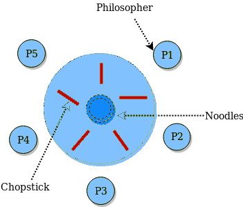

<h3>The Dining Philosopher Problem - </h3>
* The Dining Philosopher Problem states that K philosophers seated around a circular table with one chopstick between each pair of philosophers. There is one chopstick between each philosopher. A philosopher may eat if he can pickup the two chopsticks adjacent to him. One chopstick may be picked up by any one of its adjacent followers but not both.

* Deadlock
An actual deadlock occurs when every philosopher is holding his own chopstick and waiting for the one from his neighbor to become available:

> Philosopher one is holding chopstick one, but is waiting for chopstick two 

> Philosopher two is holding chopstick two, but is waiting for chopstick three 

> Philosopher three is holding chopstick three, but is waiting for chopstick four 

> Philosopher four is holding chopstick four, but is waiting for chopstick five 

> Philosopher five is holding chopstick five, but is waiting for chopstick one 

References: [link to an Example from Oracle](https://docs.oracle.com/cd/E19205-01/820-0619/gepit/index.html)