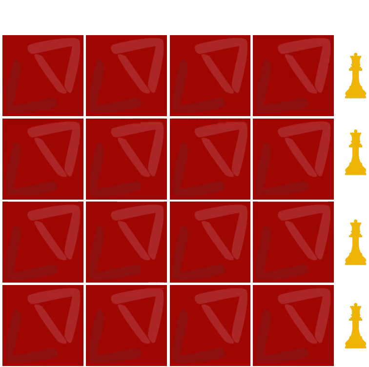

<h2>N Queens Problem</h2>
* N queens problem is one of the most common examples of backtracking. Our goal is to arrange N queens on an NxN chessboard such that no queen can strike down any other queen. A queen can attack horizontally, vertically, or diagonally.

* We start by placing the first queen anywhere arbitrarily and then place the next queen in any of the safe places. We continue this process until the number of unplaced queens becomes zero (a solution is found) or no safe place is left. If no safe place is left, then we change the position of the previously placed queen.

* **Using Backtracking to Solve N Queens**
* Let's take a 4x4 chessboard and we have to place 4 queens on it. So, we will start by placing the first queen in the first row.

* Now, the second step is to place the second queen in a safe position. Also, we can't place the queen in the first row, so we will try putting the queen in the second row this time.

* Let's place the third queen in a safe position, somewhere in the third row.

* Now, we can see that there is no safe place where we can put the last queen. So, we will just change the position of the previous queen i.e., backtrack and change the previous decision.

* Also, there is no other position where we can place the third queen, so we will go back one more step and change the position of the second queen.

* And now we will place the third queen again in a safe position other than the previously placed position in the third row.

We will continue this process until we arrive at the solution.

